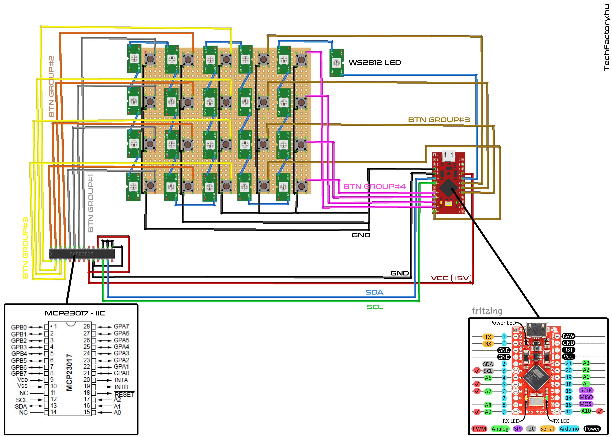

 OBSMidiRemote - windows
=======================

With this app you can turn any MIDI controller to an [Open Broadcaster Software (OBS)] remote. 
Serial devices also supported, so, you can build your own controller using microcontroller (Arduino/ESP8266/etc...)


#### Main features

- MIDI device support
- Translate MIDI commands to OBS (through OBS-Websocket plugin)
- MIDI mappings stored in XML format, [XSD available]
- LED feedback configurable
- Devices through SERIAL port also supported (Arduino ...)


#### Requirements

Microsoft [.NET Framework 4.5.2] or higher, Microsoft [Visual C++ 2015 Redistributable] (x86)
and [OBS Websocket plugin] 4.5.0 or higher

#### Download

You can download the latest release from [release page].

#### Development

- [Visual Studio 2015] & [.NET Framework 4.5.2 Developer Pack] are required.
- NuGets: Newtonsoft.JSON, websocket-sharp


#### Components
```
OBSWebsocketdotnet (MIT)	https://github.com/Palakis/obs-websocket-dotnet
PureMidi (Apache 2.0)		https://archive.codeplex.com/?p=puremidi
Newtonsoft.Json (MIT)		https://github.com/JamesNK/Newtonsoft.Json
websocket-sharp (MIT)		https://github.com/sta/websocket-sharp
```

#### Screenshot
<p align="center">

</p>

#### Sample circuit for own controller
<p align="center">

</p>
Sample arduino code available in examples folder.


#### Others (currently only in Hungarian)
- Youtube video		https://youtu.be/NEpOx8-5LfE
- XML schema howto	http://techfactory.hu/projektek/streamerbox/


[.NET Framework 4.5.2]: https://www.microsoft.com/en-US/download/details.aspx?id=53344
[Visual C++ 2015 Redistributable]: https://www.microsoft.com/en-us/download/details.aspx?id=53840
[OBS Websocket plugin]: https://github.com/Palakis/obs-websocket/releases
[.NET Framework 4.5.2 Developer Pack]: https://www.microsoft.com/download/details.aspx?id=53321
[Visual Studio 2015]: https://www.visualstudio.com/downloads/
[release page]: https://github.com/TechFactoryHU/OBSMidiRemote/releases
[XSD available]: https://github.com/TechFactoryHU/OBSMidiRemote/tree/v1.0.0/examples/xmlschemas
[Open Broadcaster Software (OBS)]: https://obsproject.com
